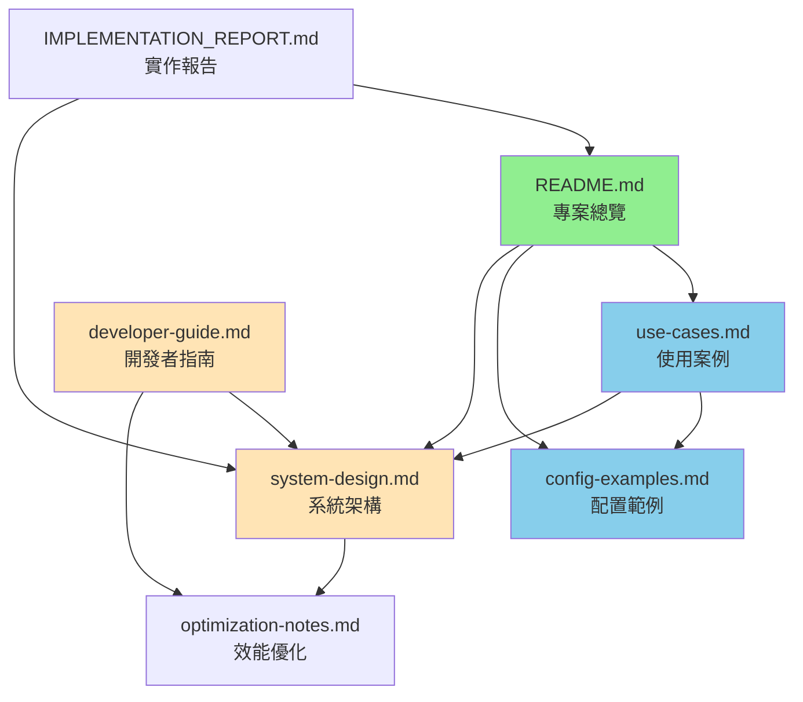

# Databricks External Tables Cleaner - 文件索引

歡迎使用 Databricks External Tables Cleaner！本文件提供完整的專案文件導覽，幫助您快速找到所需資訊。

## 📚 文件導覽

### 快速開始

| 文件 | 說明 | 適合對象 |
|------|------|----------|
| [README.md](../README.md) | 專案總覽、安裝指南、基本使用方式 | 所有使用者 |
| [使用案例與最佳實務](use-cases.md) | 10+ 個實際使用場景與解決方案 | 新手與進階使用者 |
| [配置範例](config-examples.md) | 各種場景的配置範例 | 所有使用者 |

### 技術文件

| 文件 | 說明 | 適合對象 |
|------|------|----------|
| [系統架構說明](system-design.md) | 系統架構圖、模組說明、執行流程 | 開發者、架構師 |
| [開發者指南](developer-guide.md) | 開發環境、程式碼結構、擴展指南 | 開發者、貢獻者 |
| [效能優化建議](optimization-notes.md) | 效能優化策略、成本優化建議 | 進階使用者、DevOps |

### 實作報告

| 文件 | 說明 | 適合對象 |
|------|------|----------|
| [IMPLEMENTATION_REPORT.md](../IMPLEMENTATION_REPORT.md) | Dry-run 模式與安全功能實作報告 | 專案管理者、架構師 |

---

## 🎯 依使用目的選擇文件

### 我是新手，想了解這個工具

**建議閱讀順序：**

1. **[README.md](../README.md) - 專案簡介**
   - 了解工具的目的與核心功能
   - 查看系統需求與環境配置
   - 學習基本安裝步驟

2. **[使用案例 - 基本使用案例](use-cases.md#基本使用案例)**
   - 案例 1：首次使用 - 探索性清理
   - 案例 2：清理測試環境的臨時表
   - 案例 3：清理特定格式的表

3. **[配置範例 - 預設安全配置](config-examples.md#範例-1預設安全配置推薦首次使用)**
   - 學習如何建立安全的配置
   - 了解 Dry-run 模式的使用

**預計閱讀時間：** 30 分鐘

---

### 我要在生產環境使用

**建議閱讀順序：**

1. **[README.md - 注意事項與安全性](../README.md#注意事項與安全性)**
   - 了解安全性建議
   - 學習白名單/黑名單機制
   - 查看已知限制

2. **[使用案例 - 進階安全使用案例](use-cases.md#進階安全使用案例)**
   - 案例 4：生產環境清理（高安全要求）
   - 案例 5：段階式清理大型 Schema
   - 案例 7：每週清理生產環境（含審核流程）

3. **[配置範例 - 生產環境安全配置](config-examples.md#範例-2生產環境安全配置推薦)**
   - 設定嚴格的白名單規則
   - 啟用多層安全控制
   - 設定保留條件

4. **[使用案例 - 最佳實務建議](use-cases.md#最佳實務建議)**
   - 執行前的準備工作
   - 執行時的安全措施
   - 執行後的驗證

**預計閱讀時間：** 45 分鐘

---

### 我要建立自動化 Job

**建議閱讀順序：**

1. **[使用案例 - 自動化與排程案例](use-cases.md#自動化與排程案例)**
   - 案例 6：每日自動清理測試環境
   - 案例 7：每週清理生產環境（含審核流程）

2. **[配置範例 - 自動化 Job 配置](config-examples.md#範例-4自動化-job-配置不需互動確認)**
   - Job 參數設定
   - 監控與告警配置

3. **[系統架構說明 - 錯誤處理與 Logging 策略](system-design.md#4-錯誤處理與-logging-策略)**
   - 了解日誌系統
   - 設定結構化日誌
   - 建立監控儀表板

**預計閱讀時間：** 40 分鐘

---

### 我要開發或擴展功能

**建議閱讀順序：**

1. **[開發者指南](developer-guide.md)**
   - 完整的開發環境設定
   - 程式碼結構詳細說明
   - 設計原則與模式

2. **[系統架構說明](system-design.md)**
   - 整體架構圖
   - 模組職責與互動
   - 資料流程說明

3. **[開發者指南 - 擴展與客製化](developer-guide.md#擴展與客製化)**
   - 新增其他表格式支援
   - 整合外部通知系統
   - 新增自訂過濾條件

4. **[開發者指南 - 測試指南](developer-guide.md#測試指南)**
   - 測試架構說明
   - 編寫測試的最佳實務
   - 執行測試的方法

**預計閱讀時間：** 60 分鐘

---

### 我遇到問題需要疑難排解

**快速查找：**

1. **[使用案例 - 疑難排解案例](use-cases.md#疑難排解案例)**
   - 案例 8：權限不足
   - 案例 9：儲存路徑存取失敗
   - 案例 10：大量表導致執行時間過長

2. **[使用案例 - 常見錯誤與解決方案](use-cases.md#常見錯誤與解決方案)**
   - 誤刪生產表的預防與補救
   - 配置錯誤的處理
   - 並行執行衝突的解決

3. **[README.md - 疑難排解](../README.md#疑難排解)**
   - 常見問題 FAQ
   - 權限設定
   - 效能問題

**預計閱讀時間：** 15 分鐘

---

### 我想優化執行效能

**建議閱讀順序：**

1. **[效能優化建議](optimization-notes.md)**
   - 完整的優化策略總覽
   - 優先級建議

2. **[效能優化建議 - 減少不必要的掃描與操作](optimization-notes.md#1-減少不必要的掃描與操作)**
   - 使用 information_schema 批次查詢
   - 智慧化過濾條件
   - 白名單與黑名單機制

3. **[效能優化建議 - 批次與併行處理](optimization-notes.md#2-批次與併行處理)**
   - Spark DataFrame 併行檢查
   - 批次 DROP TABLE 操作

4. **[效能優化建議 - 運算與成本優化](optimization-notes.md#5-運算與成本優化)**
   - 建議的 Cluster 配置
   - 執行排程建議
   - 成本優化策略

**預計閱讀時間：** 50 分鐘

---

## 📖 文件詳細說明

### [README.md](../README.md)
**專案總覽與使用指南**

**包含內容：**
- 專案簡介與核心功能
- 系統需求與環境配置
- 安裝與部署方式（3 種方法）
- 基本使用方式與參數說明
- Dry-run 模式與安全功能詳解
- 專案目錄結構說明
- 注意事項與安全性建議
- 疑難排解 FAQ
- 相關資源連結

**目標讀者：** 所有使用者

**關鍵章節：**
- [Dry-run 模式與安全功能](../README.md#dry-run-模式與安全功能-✨-new)
- [注意事項與安全性](../README.md#注意事項與安全性)
- [疑難排解](../README.md#疑難排解)

---

### [system-design.md](system-design.md)
**系統架構與程式設計說明**

**包含內容：**
- 整體執行流程說明（5 個階段）
- 系統架構圖（4 種視圖）
  - 整體系統架構
  - 詳細執行流程圖
  - 模組互動時序圖
  - 資料流程圖
- 各模組詳細說明（8 個模組）
- 錯誤處理與 Logging 策略
- 技術債務與未來改進
- 相依性與外部系統說明

**目標讀者：** 開發者、架構師、技術主管

**關鍵章節：**
- [系統架構圖](system-design.md#2-系統架構圖)
- [模組說明](system-design.md#3-模組說明)
- [錯誤處理與 Logging 策略](system-design.md#4-錯誤處理與-logging-策略)

---

### [developer-guide.md](developer-guide.md)
**開發者完整指南**

**包含內容：**
- 開發環境設定（本地 + Databricks）
- 程式碼結構深入說明
- 設計原則與模式（4 個核心原則）
- 擴展與客製化指南（3 個實際範例）
- 測試指南（架構、執行、最佳實務）
- 程式碼風格指南（命名、型別、文檔、註解）
- Git Commit 訊息規範
- 貢獻流程與 Code Review 檢查清單
- 常見開發場景（3 個實用場景）

**目標讀者：** 開發者、貢獻者

**關鍵章節：**
- [設計原則與模式](developer-guide.md#設計原則與模式)
- [擴展與客製化](developer-guide.md#擴展與客製化)
- [測試指南](developer-guide.md#測試指南)

---

### [use-cases.md](use-cases.md)
**使用案例與最佳實務**

**包含內容：**
- 基本使用案例（3 個）
  - 首次使用探索
  - 清理測試環境
  - 清理特定格式表
- 進階安全使用案例（3 個）
  - 生產環境清理
  - 段階式清理大型 Schema
- 自動化與排程案例（2 個）
  - 每日自動清理
  - 每週清理含審核流程
- 疑難排解案例（3 個）
  - 權限不足
  - 儲存路徑存取失敗
  - 效能問題
- 最佳實務建議（3 個階段）
- 常見錯誤與解決方案（3 個）

**目標讀者：** 所有使用者，特別是新手

**關鍵章節：**
- [基本使用案例](use-cases.md#基本使用案例)
- [進階安全使用案例](use-cases.md#進階安全使用案例)
- [最佳實務建議](use-cases.md#最佳實務建議)

---

### [config-examples.md](config-examples.md)
**配置範例與說明**

**包含內容：**
- 配置參數完整說明
  - 基本參數
  - 白名單/黑名單
  - 保留條件
  - 進階參數
- 5 種配置範例
  - 預設安全配置
  - 生產環境安全配置
  - 測試環境配置
  - 自動化 Job 配置
  - 開發環境配置
- 使用方式詳解
- 疑難排解

**目標讀者：** 所有使用者

**關鍵章節：**
- [配置參數說明](config-examples.md#配置參數說明)
- [配置範例](config-examples.md#配置範例)

---

### [optimization-notes.md](optimization-notes.md)
**效能與成本優化建議**

**包含內容：**
- 優化建議總覽（8 個項目）
- 減少不必要的掃描與操作（3 個策略）
- 批次與併行處理（2 個方法）
- 減少 IO 與儲存操作風險（2 個策略）
- 利用 Databricks 平台特性（2 個方法）
- 運算與成本優化（3 個建議）
- 監控與可觀測性
- 優先級建議

**目標讀者：** 進階使用者、DevOps、架構師

**關鍵章節：**
- [優化建議總覽](optimization-notes.md#優化建議總覽)
- [建議的 Cluster 配置](optimization-notes.md#52-建議的-cluster-配置)
- [總結與優先級建議](optimization-notes.md#7-總結與優先級建議)

---

### [IMPLEMENTATION_REPORT.md](../IMPLEMENTATION_REPORT.md)
**Dry-run 模式與安全功能實作報告**

**包含內容：**
- 專案概述
- 已完成功能清單（7 項）
- 新增檔案說明（4 個）
- 更新檔案說明（3 個）
- 統計資訊（程式碼量、測試覆蓋率）
- 功能驗收檢查清單
- 向後相容性說明
- 使用建議

**目標讀者：** 專案管理者、架構師、技術主管

**關鍵章節：**
- [已完成功能](../IMPLEMENTATION_REPORT.md#已完成功能)
- [向後相容性](../IMPLEMENTATION_REPORT.md#向後相容性)

---

## 🔗 文件間的關聯

---

## 📝 文件維護

### 更新頻率

| 文件 | 更新頻率 | 負責人 |
|------|----------|--------|
| README.md | 每次功能變更 | 專案維護者 |
| system-design.md | 架構變更時 | 技術主管 |
| developer-guide.md | 開發流程變更時 | 開發團隊 |
| use-cases.md | 發現新場景時 | 所有貢獻者 |
| config-examples.md | 新增配置選項時 | 專案維護者 |
| optimization-notes.md | 發現新優化點時 | 效能團隊 |

### 貢獻文件

如果您發現文件有錯誤或想新增內容：

1. Fork 專案
2. 修改相關文件
3. 提交 Pull Request
4. 在 PR 描述中說明變更內容

### 文件風格指南

- **語言**：所有文件使用繁體中文
- **格式**：使用 Markdown 格式
- **結構**：清楚的標題層級和目錄
- **範例**：提供實際可執行的程式碼範例
- **圖表**：優先使用 Mermaid 繪製圖表

---

## 🆘 需要協助？

### 找不到需要的資訊？

1. 查看 [README.md 的疑難排解章節](../README.md#疑難排解)
2. 瀏覽 [使用案例文件](use-cases.md) 尋找類似場景
3. 在 GitHub 開啟 Issue 詢問

### 想貢獻文件？

參考 [開發者指南 - 貢獻流程](developer-guide.md#貢獻流程)

### 發現文件錯誤？

請在 GitHub 開啟 Issue 或直接提交 Pull Request 修正

---

## 📊 文件統計

| 項目 | 數量 |
|------|------|
| 總文件數 | 7 個 |
| 總字數 | 約 50,000 字 |
| 使用案例數 | 10+ 個 |
| 配置範例數 | 5 個 |
| 架構圖數 | 4 個 |
| 程式碼範例數 | 50+ 個 |

---

**最後更新：** 2026-02-12  
**維護者：** Databricks External Tables Cleaner 專案團隊  
**文件版本：** 1.0
