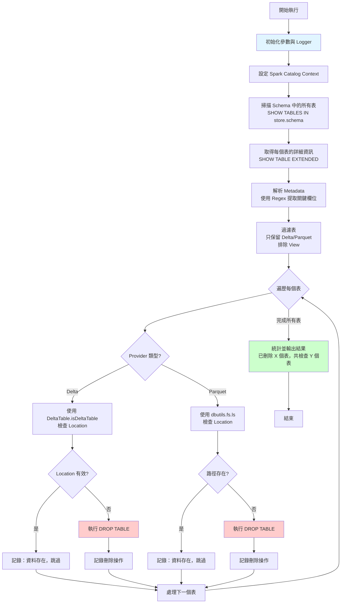

# 系統架構與程式設計說明

## 1. 整體流程說明

Databricks External Tables Cleaner 的執行流程分為五個主要階段：

### 階段 1：初始化與參數設定
- 讀取使用者提供的參數（store、schema、debug）
- 初始化日誌系統（logs 類別）
- 設定 Spark session 和 catalog context

### 階段 2：掃描 External Tables
- 使用 `SHOW TABLES` 命令列舉指定 schema 中的所有表
- 過濾掉臨時表（temporary tables），只保留持久化的物件
- 回傳表名稱列表供下一階段處理

### 階段 3：取得表的詳細資訊
- 對每個表執行 `SHOW TABLE EXTENDED` 命令
- 使用正規表達式（regex）解析表的 metadata，包含：
  - Database：所屬的 database/schema
  - Table：表名稱
  - Provider：資料格式（Delta、Parquet 等）
  - Type：表類型（MANAGED、EXTERNAL、VIEW）
  - Location：外部儲存的實際路徑（如 `abfss://...` 或 `s3://...`）
- 過濾條件：只保留 provider 為 'delta' 或 'parquet' 且 type 不是 'view' 的表

### 階段 4：判定刪除條件
對於每個表，根據其 provider 類型執行不同的檢查邏輯：

**Delta Tables：**
- 使用 `DeltaTable.isDeltaTable()` 檢查 location 路徑是否為有效的 Delta Lake 表
- 如果回傳 True：表示資料存在，不刪除
- 如果回傳 False：表示 location 路徑無效或資料不存在，標記為可刪除

**Parquet Tables：**
- 使用 `dbutils.fs.ls()` 檢查 location 路徑是否存在
- 如果路徑可存取：表示資料存在，不刪除
- 如果路徑不存在或存取失敗：標記為可刪除

### 階段 5：執行刪除與記錄結果
- 對於標記為可刪除的表，執行 `DROP TABLE` SQL 命令
- 記錄每次刪除操作的詳細日誌
- 統計刪除的表數量
- 回傳最終結果

## 2. 系統架構圖



### 架構說明

**使用者介面層：**
- Databricks Job 或手動執行的 Notebook
- 提供參數輸入（store、schema、debug）

**應用邏輯層：**
- `scripts/clean_tables_without_storage.py` 或 `notebooks/clean_tables_without_storage.py`
- 協調整體流程

**核心功能層：**
- `common/helpers.py` 模組
- 包含所有核心函式

**資料與儲存層：**
- Databricks Metastore / Unity Catalog：儲存表的 metadata
- 外部儲存系統（ADLS、S3、GCS）：實際資料檔案位置

## 3. 模組說明

### 3.1 common/helpers.py

這是整個系統的核心模組，包含所有主要功能函式和類別。

#### 函式：`file_exists(spark, dir)`
**職責：**
- 檢查指定的 DBFS 路徑或外部儲存路徑是否存在

**實作方式：**
- 使用 `dbutils.fs.ls(dir)` 嘗試列出路徑內容
- 如果成功：回傳 True
- 如果拋出例外（路徑不存在）：回傳 False
- 如果是權限問題（AccessDeniedException）：向上拋出例外

**用途：**
- 在處理 Parquet 表時，驗證外部儲存路徑是否仍然存在

---

#### 函式：`get_tables(spark, store, schema, istemporary)`
**職責：**
- 列舉指定 metastore 和 schema 中的所有表名稱

**實作方式：**
- 執行 SQL：`SHOW TABLES IN {store}.{schema}`
- 根據 `istemporary` 參數過濾表類型
- 回傳表名稱的 Python list

**用途：**
- 作為掃描流程的第一步，取得需要檢查的表清單

---

#### 函式：`get_tables_details(spark, store, schema, tables)`
**職責：**
- 取得表清單中每個表的詳細 metadata

**實作方式：**
1. 建立空的 DataFrame，schema 為 `[Database, Table, Provider, Type, Location]`
2. 設定當前 catalog：`USE CATALOG {store}`
3. 對每個表執行：`SHOW TABLE EXTENDED IN {store}.{schema} LIKE '{table_name}'`
4. 使用 `regexp_extract` 從 information 欄位中提取關鍵資訊：
   - Database
   - Table
   - Provider（例如：delta、parquet）
   - Type（例如：MANAGED、EXTERNAL）
   - Location（外部儲存路徑）
5. 將所有表的資訊合併成單一 DataFrame
6. 過濾：只保留 provider 為 'delta' 或 'parquet'，且 type 不是 'view' 的表

**用途：**
- 提供決策所需的完整 metadata，特別是 Location 資訊

**潛在效能問題：**
- 對每個表執行單獨的 SQL 命令，可能造成大量的 metastore 查詢
- 建議優化：考慮使用 `information_schema.tables` 一次性查詢（參見 optimization-notes.md）

---

#### 函式：`create_empty_dataframe(spark, columns, types)`
**職責：**
- 建立一個空的 Spark DataFrame，具有指定的 schema

**實作方式：**
- 根據 columns 和 types 清單建立 StructType schema
- 支援常見的 Spark 資料類型（string、integer、long、float、double、boolean、timestamp）
- 使用 `spark.createDataFrame([], schema)` 建立空 DataFrame

**用途：**
- 初始化 `get_tables_details` 函式中的結果 DataFrame
- 測試程式時建立測試資料

---

#### 類別：`logs`
**職責：**
- 提供統一的日誌管理介面，支援 console 輸出和 log4j 整合

**屬性：**
- `name`：Logger 名稱
- `level`：日誌等級（info、debug、warning、error）
- `debug`：布林值，決定輸出模式
  - `True`：直接 print 到 console（開發環境）
  - `False`：寫入 log4j 檔案（生產環境）

**方法：**
- `get_logger()`：初始化 logger 實例
  - 如果 `debug=False`，連接到 Spark 的 log4j logger
  - 如果 `debug=True`，不建立 logger 實例（使用 print）
- `trace(msg)`：輸出日誌訊息
  - 根據 `debug` 和 `level` 設定選擇輸出方式

**用途：**
- 記錄清理流程的每個步驟
- 在開發時便於除錯，在生產環境時整合到 Spark 的日誌系統

---

#### 函式：`drop_table_definition_without_storage(spark, df, log)`
**職責：**
- 這是核心的清理邏輯，負責實際執行刪除操作

**實作方式：**
1. 遍歷輸入的 DataFrame（包含表的 metadata）
2. 對每個表：
   - 記錄開始檢查的日誌
   - 根據 Provider 類型選擇檢查方式：

     **如果是 Delta：**
     - 呼叫 `DeltaTable.isDeltaTable(spark, row.Location)`
     - 如果回傳 False（不是有效的 Delta 表）：
       - 執行 `DROP TABLE {database}.{table}`
       - 增加刪除計數
       - 記錄刪除成功日誌
     - 如果回傳 True（資料存在）：
       - 記錄跳過日誌

     **如果是 Parquet：**
     - 呼叫 `file_exists(spark, row.Location)`
     - 如果回傳 False（路徑不存在）：
       - 執行 `DROP TABLE {database}.{table}`
       - 增加刪除計數
       - 記錄刪除成功日誌
     - 如果回傳 True（路徑存在）：
       - 記錄跳過日誌

3. 回傳刪除的表總數

**用途：**
- 實際執行清理邏輯
- 是整個系統最關鍵的部分

**注意事項：**
- 刪除操作不可逆，需要謹慎
- 目前沒有實作 dry-run 模式
- 每次刪除都會立即執行 SQL，沒有批次處理

---

### 3.2 scripts/clean_tables_without_storage.py

**職責：**
- 作為主要的執行入口點（script 版本）

**實作方式：**
- 使用 `dbutils.widgets` 接收參數
- 呼叫 `common.helpers` 中的函式
- 協調整體執行流程

---

### 3.3 notebooks/clean_tables_without_storage.py

**職責：**
- Notebook 版本的執行入口點

**差異：**
- 包含 Magic Commands（`# MAGIC %md`）用於說明文件
- 分成多個 COMMAND cells，便於逐步執行和除錯
- 功能與 scripts 版本相同

---

### 3.6 common/config.py ✨ NEW

**職責：**
- 管理清理工具的所有配置參數
- 提供白名單/黑名單模式匹配功能
- 檢查保留條件（建立日期、最後存取時間）

**核心類別：CleanupConfig**

```python
class CleanupConfig:
    def __init__(
        self,
        dry_run: bool = True,
        whitelist_patterns: Optional[List[str]] = None,
        blacklist_patterns: Optional[List[str]] = None,
        min_create_date: Optional[date] = None,
        max_last_access_age_days: Optional[int] = None,
        require_confirmation: bool = False,
        estimate_storage_size: bool = False
    )
```

**主要方法：**

1. **is_table_deletion_allowed(table_full_name: str) -> tuple[bool, str]**
   - 檢查表是否允許刪除
   - 先檢查白名單（優先級最高）
   - 再檢查黑名單
   - 回傳 (是否允許, 原因說明)

2. **check_retention_conditions(create_time, last_access_time) -> tuple[bool, str]**
   - 檢查表是否符合保留條件
   - 驗證建立日期和最後存取時間
   - 回傳 (是否允許刪除, 原因說明)

3. **to_dict() / from_dict()**
   - 配置的序列化與反序列化
   - 支援從 JSON 檔案載入配置

**預設配置範例：**

```python
# 安全預設配置
DEFAULT_CONFIG = CleanupConfig(
    dry_run=True,
    require_confirmation=True
)

# 生產環境安全配置
PRODUCTION_SAFE_CONFIG = CleanupConfig(
    dry_run=True,
    whitelist_patterns=['prod.*', 'production.*', 'critical_*'],
    blacklist_patterns=['system.*', 'metadata.*'],
    max_last_access_age_days=180,
    require_confirmation=True
)
```

**用途：**
- 集中管理所有安全控制參數
- 提供可重複使用的配置範本
- 支援從檔案載入配置

---

### 3.7 新增的安全函式 ✨ NEW

#### 函式：`drop_table_definition_without_storage_safe()`

**職責：**
- 升級版的清理函式，支援完整的安全功能
- 整合 dry-run、白名單/黑名單、保留條件等檢查

**簽名：**
```python
def drop_table_definition_without_storage_safe(
    spark: SparkSession,
    df: DataFrame,
    log: logs,
    config: Optional[CleanupConfig] = None
) -> Tuple[int, List[Dict]]
```

**處理流程：**
1. 載入配置（如未提供則使用預設安全配置）
2. 對每個表執行以下檢查：
   - 白名單/黑名單檢查
   - 儲存是否存在檢查
   - （可選）保留條件檢查
3. 根據 dry_run 模式決定：
   - `dry_run=True`：記錄將被刪除的表
   - `dry_run=False`：實際執行 DROP TABLE
4. 記錄詳細的統計摘要

**回傳值：**
- `deleted`: 刪除（或將被刪除）的表數量
- `candidates`: 所有候選表的詳細資訊列表
  - `table_name`: 完整表名稱
  - `action`: 採取的動作（deleted/skipped_whitelist/skipped_blacklist等）
  - `reason`: 原因說明
  - `location`: 儲存路徑

**統計資訊：**
函式會輸出詳細的統計摘要：
- 刪除（或預計刪除）的表數量
- 因白名單跳過的數量
- 因黑名單跳過的數量
- 因資料存在跳過的數量
- 總計檢查的表數量

---

#### 函式：`confirm_deletion_interactive()`

**職責：**
- 提供互動式確認功能
- 顯示候選表清單並要求使用者確認

**簽名：**
```python
def confirm_deletion_interactive(
    candidates: List[Dict],
    dry_run: bool = False
) -> bool
```

**處理流程：**
1. 過濾出將被刪除的表（action='dry_run_candidate' 或 'deleted'）
2. 以表格格式顯示候選表清單
3. 顯示統計資訊（總表數、預計釋放空間等）
4. 要求使用者輸入 `YES` 確認

**使用範例：**
```python
deleted, candidates = drop_table_definition_without_storage_safe(
    spark, tabledetailsDF, logger, config
)

if config.require_confirmation:
    if not confirm_deletion_interactive(candidates, config.dry_run):
        print('操作已取消')
        return
```

**適用場景：**
- Notebook 互動環境
- CLI 執行
- 不適用於自動化 Job（無互動環境）

---

### 3.8 notebooks/clean_tables_with_dryrun.py ✨ NEW

**職責：**
- 示範如何使用進階安全功能
- 提供完整的 Dry-run + 互動確認流程

**特色：**
1. 使用 Databricks Widgets 接收參數
2. 支援動態設定白名單/黑名單
3. 完整的 Dry-run 流程示範
4. 將結果轉換為 DataFrame 方便查看
5. 提供多種使用範例和最佳實務建議

**執行流程：**
1. 設定參數（store、schema、dry_run、whitelist等）
2. 建立 CleanupConfig 配置
3. 掃描表並取得詳細資訊
4. 執行清理（dry-run 或實際刪除）
5. 顯示候選表 DataFrame
6. （可選）互動式確認
7. 輸出統計摘要

**與原始 Notebook 的差異：**
- 原始版本：直接刪除，無安全控制
- 新版本：支援 dry-run、白名單/黑名單、互動確認

---

### 3.9 tests/test_config.py ✨ NEW

**職責：**
- 測試 CleanupConfig 類別的各種功能
- 驗證白名單/黑名單模式匹配
- 測試保留條件檢查

**測試類別：**

1. **TestCleanupConfig**
   - 測試預設配置
   - 測試自訂配置
   - 測試序列化/反序列化

2. **TestWhitelistBlacklist**
   - 測試白名單功能
   - 測試黑名單功能
   - 測試優先級（白名單 > 黑名單）
   - 測試萬用字元匹配

3. **TestRetentionConditions**
   - 測試建立日期條件
   - 測試最後存取時間條件
   - 測試多個條件組合

4. **TestConfigIntegration**
   - 測試完整的配置場景
   - 測試生產環境配置範例
   - 測試測試環境配置範例

**涵蓋率：**
- CleanupConfig 類別的所有公開方法
- 各種邊界條件和異常情況
- 實際使用場景的整合測試

---

### 3.4 scripts/context.py 與 notebooks/context.py

**職責：**
- 設定 Python 模組搜尋路徑
- 讓 scripts 和 notebooks 可以正確 import `common.helpers`

**實作方式：**
- 使用 `sys.path.append()` 將專案根目錄加入 Python path
- 從 `common.helpers` 匯入所有必要函式

---

### 3.5 tests/test_clean_tables_without_storage.py

**職責：**
- 提供單元測試，確保各函式正常運作

**測試案例：**
- `test_file_exists_*`：測試檔案存在性檢查
- `test_get_tables_*`：測試表列舉功能
- `test_get_table_details_*`：測試 metadata 解析
- `test_create_empty_dataframe`：測試 DataFrame 建立
- `test_drop_table_definition_without_storage_*`：測試刪除邏輯

**執行方式：**
- 使用 `databricks-connect` 連接到遠端 Databricks cluster
- 在實際的 Databricks 環境中執行測試

---

## 4. 錯誤處理與 Logging 策略

### 4.1 目前的錯誤處理機制

**file_exists 函式：**
- 捕捉一般的檔案不存在例外，回傳 False
- 對於權限錯誤（`AccessDeniedException`），會向上拋出，讓呼叫者處理
- 這是合理的設計，因為權限問題需要手動解決

**drop_table_definition_without_storage 函式：**
- 目前沒有 try-catch 包裝
- 如果 `DROP TABLE` 失敗（例如：表被鎖定、權限不足），會中斷整個流程
- 已刪除的表不會回滾

**get_tables_details 函式：**
- 使用 regex 解析文字，如果 metadata 格式變更可能導致解析失敗
- 沒有驗證 Location 欄位是否為有效的路徑格式

### 4.2 建議的改進方向

#### 4.2.1 結構化日誌

**目前狀況：**
- 使用 print 或 log4j 輸出文字訊息
- 難以進行後續分析和查詢

**建議改進：**
1. **記錄到 Delta Table：**
   ```python
   log_schema = ['timestamp', 'store', 'schema', 'table', 'action', 'result', 'message']
   ```
   - 每次刪除操作都寫入一筆記錄
   - 可以用於審計和分析
   - 便於追蹤哪些表被刪除、何時刪除

2. **使用 JSON 格式日誌：**
   - 便於與日誌聚合系統（如 Elasticsearch、Splunk）整合
   - 支援更靈活的查詢和過濾

#### 4.2.2 錯誤恢復機制

**建議實作：**
1. **逐表錯誤處理：**
   ```python
   for row in df.collect():
       try:
           # 刪除邏輯
       except Exception as e:
           log.error(f"刪除表 {row.Table} 時失敗: {str(e)}")
           failed_tables.append(row.Table)
           continue  # 繼續處理下一個表
   ```

2. **重試機制：**
   - 對於暫時性錯誤（如網路問題、metastore 暫時無回應），實作自動重試
   - 使用 exponential backoff 避免過度重試

3. **失敗通知：**
   - 在執行結束時，彙總並報告失敗的表
   - 可考慮整合 email 或 Slack 通知

#### 4.2.3 驗證與安全檢查 ✅ 已實作

**已實作的安全功能：**
1. **Dry-run 模式：**
   - 新增函式 `drop_table_definition_without_storage_safe()`
   - 支援 `dry_run=True` 參數，僅記錄將被刪除的表
   - 明確標示 `[DRY-RUN]` 避免混淆

2. **白名單/黑名單機制：**
   - 透過 `CleanupConfig` 類別管理
   - 支援萬用字元模式匹配（`*` 和 `?`）
   - 白名單優先級最高，黑名單次之

3. **保留條件檢查：**
   - 支援建立日期篩選 (`min_create_date`)
   - 支援最後存取時間篩選 (`max_last_access_age_days`)
   - 無時間資訊時會警告使用者

4. **互動式確認：**
   - `confirm_deletion_interactive()` 函式
   - 顯示候選表清單並要求輸入 YES 確認
   - 適用於 Notebook 和 CLI 環境

**建議未來加入：**
1. **Location 路徑驗證：**
   - 檢查 Location 是否為合法的外部儲存路徑
   - 避免誤刪內部管理的資料

2. **表類型再確認：**
   - 在刪除前再次確認表的類型（確保是 EXTERNAL）
   - 避免誤刪 MANAGED 表

#### 4.2.4 日誌等級管理

**建議改進 logs 類別：**
- 支援更細緻的日誌等級（DEBUG、INFO、WARNING、ERROR、CRITICAL）
- 在不同階段使用適當的等級：
  - DEBUG：詳細的執行步驟
  - INFO：正常的操作流程
  - WARNING：異常但可處理的情況（如表已不存在）
  - ERROR：失敗的操作（如刪除失敗）

### 4.3 監控建議

**建議實作的監控指標：**
1. 每次執行掃描的表總數
2. 刪除的表數量
3. 跳過的表數量（資料仍存在）
4. 失敗的操作數量
5. 執行時間

這些指標可以：
- 寫入 Delta Table 供後續分析
- 整合到 Databricks Job metrics
- 發送到外部監控系統（如 Datadog、CloudWatch）

## 5. 技術債務與未來改進

### 5.1 已知的技術債務

1. **單執行緒處理**：目前逐一處理表，無法充分利用 Spark 的分散式運算能力
2. **無批次操作**：每個表都執行獨立的 SQL 命令，增加 metastore 負擔
3. **硬編碼的過濾條件**：只支援 Delta 和 Parquet，寫死在程式碼中
4. ~~**缺少配置檔**~~：✅ 已解決 - 已新增 `CleanupConfig` 類別支援配置管理
5. **測試覆蓋率不足**：主要的刪除邏輯仍需更完整的端到端測試（已新增單元測試但缺少整合測試）

### 5.2 已完成的改進 ✅

1. **Dry-run 模式**：✅ 已實作
   - 新增 `drop_table_definition_without_storage_safe()` 函式
   - 支援預覽模式，不實際刪除
   - 提供詳細的候選表資訊

2. **白名單/黑名單機制**：✅ 已實作
   - 透過 `CleanupConfig` 管理
   - 支援萬用字元模式匹配
   - 白名單優先級最高

3. **保留條件**：✅ 已實作
   - 支援建立日期篩選
   - 支援最後存取時間篩選
   - 缺少時間資訊時會警告

4. **互動式確認**：✅ 已實作
   - `confirm_deletion_interactive()` 函式
   - 顯示候選表清單並要求確認
   - 適用於 Notebook 和 CLI

5. **配置管理系統**：✅ 已實作
   - `CleanupConfig` 類別集中管理所有參數
   - 支援序列化/反序列化
   - 提供預設配置範本

6. **完整的單元測試**：✅ 已實作
   - `test_config.py` 涵蓋配置相關功能
   - 測試白名單/黑名單模式匹配
   - 測試保留條件檢查

7. **範例與文件**：✅ 已實作
   - 新增 `clean_tables_with_dryrun.py` 範例 Notebook
   - 新增 `config-examples.md` 配置範例文件
   - 更新 README 和 system-design.md

### 5.3 未來改進方向

詳細的優化建議請參考 `docs/optimization-notes.md`。

## 6. 相依性與外部系統

### 6.1 Databricks 平台相依性

- **Spark Session**：所有操作都需要有效的 Spark session
- **dbutils**：用於檔案系統操作
- **Unity Catalog / Hive Metastore**：儲存表的 metadata
- **Delta Lake**：檢查 Delta 表的有效性

### 6.2 外部儲存系統

- **Azure Data Lake Storage (ADLS)**：常見的外部表儲存位置
- **Amazon S3**：另一個常見的儲存選項
- **Google Cloud Storage (GCS)**：較少使用但也支援

### 6.3 權限需求

執行此工具需要以下權限：
- Databricks workspace 存取權
- 對目標 catalog 的 USE CATALOG 權限
- 對目標 schema 的 USE SCHEMA 和 MODIFY 權限
- 對外部儲存的讀取權限（用於檢查檔案是否存在）

## 7. 總結

Databricks External Tables Cleaner 是一個簡單但實用的工具，專注於解決 external tables 的孤兒 metadata 問題。其設計理念是：

- **簡單明瞭**：流程清晰，容易理解和維護
- **安全為先**：只刪除確認無資料的表定義
- **可擴展**：模組化設計，便於未來加入新功能

透過本文件的說明，開發者應該能夠：
- 理解系統的整體架構
- 知道每個模組的職責
- 進行必要的維護和擴展

更多關於效能優化的建議，請參閱 `docs/optimization-notes.md`。
